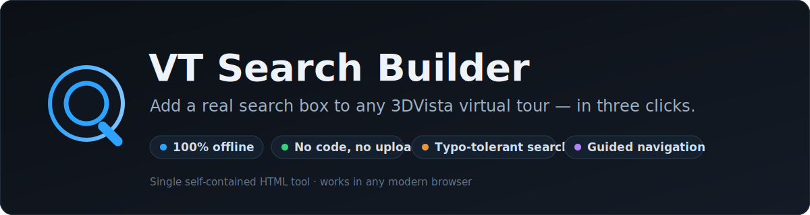
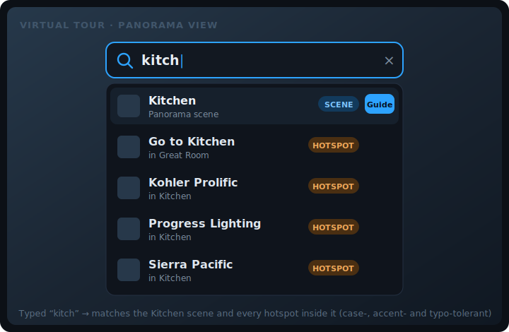
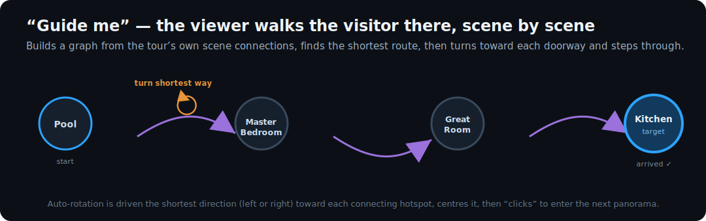

<p align="center">

  https://ahmadmehri.github.io/VT-Search-Builder/VT-Search-Builder.html
  
  
  
</p>

<p align="center">
  
  
  
  
</p>

<h1 align="center">VT Search Builder</h1>

<p align="center">
  <b>Add a real search box — and one-click guided navigation — to any
  <a href="https://www.3dvista.com/">3DVista</a> virtual tour.</b><br>
  No coding. No upload. Works the same online or offline.
</p>

---

3DVista is great at making virtual tours, but the exported tour has **no search**. If a
visitor wants the *kitchen*, the *fire extinguisher*, or *photo 12*, they have to click
around and hope. **VT Search Builder** fixes that: drop in your exported tour folder, and it
hands you back the **same tour with a search box baked in** — plus an optional *“Guide me”*
button that walks visitors to a place scene‑by‑scene.

Everything happens **in your browser**. Nothing is uploaded, no server, no build tools, no
account. The result is plain static JavaScript that drives the tour’s own player, so it works
identically whether the tour is hosted on a website or opened straight from a USB stick.

<p align="center">
  
</p>

---

## ✨ Features

- 🔎 **Instant search** over scenes, hotspots, photos, videos and albums.
- 🧠 **Forgiving matching** — case‑insensitive, accent‑insensitive (*cafe* = *café*), and
  **typo‑tolerant** (*bedrom*, *kitchn*, *entrence* still hit). Multi‑word queries work too.
- 🧭 **Guided navigation** — for a scene result, visitors can **Jump** (go straight there) or
  **Guide me** (the viewer walks the route, turning toward each doorway and stepping through).
- ✏️ **Rename & add keywords** — give a cryptic `01` a friendly *“Kitchen counter”* and extra
  search words (*front door, lobby, foyer…*). The original name always stays searchable.
- 🎛️ **You choose what’s searchable** — toggle each element type on/off.
- 📋 **Browse‑all mode** — open the box empty to see the whole tour grouped by type.
- 📦 **One‑click export** — get a ready‑to‑publish `.zip`, or just the two small files to drop
  in yourself.
- 🖥️ **Dual‑skin aware** — reads every `script*.js` data file and re‑attaches across desktop/
  mobile skin switches.
- 🔒 **100% offline & private** — no AI or internet at search time; nothing leaves the browser.

---

## 🚀 How it works — 3 steps, no editing

<p align="center">
  
</p>

1. **Open** `VT-Search-Builder.html` in any modern browser (just double‑click it).
2. **Drop your exported tour folder** onto the page (or click *Choose tour folder…*). This is
   the folder that contains `index.htm`, `script.js`, `media/`, `locale/`…  
   The tool shows what it found and a **live preview** of the search box. Optionally tweak the
   icon position, accent colour, placeholder text, and **rename items / add keywords**.
3. Click **“Export published tour (.zip)”**.

Unzip the file and upload the folder to your website — or just open its `index.htm` locally.
The search box is already built in. **You never edit any code.**

> **Advanced:** the tool can also hand you just `vtsearch.js` + a patched `index.htm` if you’d
> rather drop those two files into your existing folder yourself.

It works for **any** 3DVista HTML export — re‑run it once per tour.

---

## 🧭 Guided navigation (“Guide me”)

This is the part most search add‑ons can’t do. When a search result is a **scene**, the
visitor gets a **Guide me** button. Instead of teleporting, the viewer **walks them there**:

<p align="center">
  
</p>

- The builder reads the tour’s **own scene‑connection graph** (which doorway leads where).
- On *Guide me*, it finds the **shortest route** from the current scene to the target.
- For each hop it **rotates the camera the shortest way** (left *or* right) until the doorway
  hotspot is centred, then **“clicks” it** to step into the next panorama — repeating until
  the visitor arrives.
- A small **Stop** button lets the visitor bail out at any time, and the tour’s own camera
  settings are restored afterwards.

Toggle it off in **Step 2 → Appearance** if you don’t want it.

---

## 🔍 What gets indexed

| Searchable | Action when chosen |
|---|---|
| Panorama **scenes** | opens that scene (and can *guide* the visitor there) |
| **Hotspots** (points of interest) | jumps to the scene it lives in and tries to trigger it |
| **Videos** | opens/plays the video |
| **Photos / albums** | opens it **if** the player allows; otherwise lands in its scene, or shows a short “open it from the menu” note |

Scene/photo/video names come from the tour’s `locale/*.txt`; hotspot results use their
tooltips. **Multiple languages are supported** — the tool reads every `locale/*.txt`.

### Which types are on by default

In **Step 2** you tick which element types are searchable:

- **Scenes and hotspots are ON by default** — the player opens them reliably.
- **Photos, albums and videos are OFF by default** — a 3DVista export only lets an outside
  script *switch the main media*, so pop‑up photo/album slides usually can’t be opened from a
  script. You can tick them on if you’ve confirmed they open in your tour; if a re‑ticked item
  can’t open, the search shows a short *“open it from the menu”* note instead of failing
  silently.

### Names & search keywords (optional but powerful)

Each element has two optional boxes — **you never lose the original name**, it stays
searchable either way:

- **Display name** — a friendlier label to show & search instead of a vague one
  (`01` → `Kitchen counter`).
- **Extra search words** — comma‑separated terms a visitor might type
  (`Entrance` → `front door, lobby, foyer, start`). Searching any of them lands on that item.

---

## 📥 Get it / use it

**You don’t need Node or any tools to *use* the builder.** Just grab the single HTML file:

1. Download **`VT-Search-Builder.html`** from this repo (or clone the repo).
2. Double‑click it to open in your browser.
3. Follow the 3 steps above.

> 💡 Folder drag‑and‑drop is most reliable in **Firefox** and on hosted pages. In any browser
> the **“Choose tour folder…”** button always works.

---

## 🛠️ Build from source

The shipped `VT-Search-Builder.html` is generated by splicing the pieces in `src/` together
and embedding the logo. To rebuild after editing a source file:

```bash
node build.js
# or
npm run build
```

No dependencies — it’s plain Node.js. The build also parse‑checks the widget and fails loudly
if a placeholder wasn’t replaced.

### Project structure

```
VT-Search-Builder.html   ← the tool (built artifact — this is the only file users open)
build.js                 ← splices src/ → VT-Search-Builder.html, embeds the logo
package.json             ← npm run build
rockbench_Logo.jpg       ← channel logo, embedded into the tool at build time
src/
  builder-shell.html     ← the builder UI shell (parser + widget are spliced in)
  vt-parser.js           ← DOM-free tour parser (scenes, hotspots, thumbnails, scene graph)
  vtsearch-widget.js     ← the runtime search widget injected into published tours
docs/                    ← README artwork (SVG)
tutorial/                ← video tutorial deck + narration script
  VT-Search-Builder-Tutorial.pptx
  Tutorial-Script.md     ← scene-by-scene "on screen / narration" script
  build_tutorial_pptx.js
```

---

## 🧩 How it works under the hood

**`src/vt-parser.js`** — a pure, DOM‑free parser (runs in the browser *and* under Node). It
does a single string‑aware structural scan of the tour’s `script*.js` data, collecting:

- searchable items from each `locale/*.txt` (scene/photo/video/album **labels** and hotspot
  **tooltips**), with thumbnails, and
- a **scene graph** (`panoId → { label, neighbors:[{ to, yaw, pitch, overlayID }] }`) built
  from the tour’s `AdjacentPanorama` links — this is what powers *Guide me*.

> The scanner only attributes a doorway to the *innermost* panorama that encloses it, and
> registers a scene node only for objects that hold exactly one `Panorama` class — this avoids
> double‑counting links across the device/skin wrappers a 3DVista export nests them in.

**`src/vtsearch-widget.js`** — the runtime widget injected into the published tour. It builds
the search UI, runs the fuzzy match (normalise → token match → Levenshtein fallback), and
drives the tour’s own player API for navigation and the guided walk. It re‑attaches itself via
a `MutationObserver` so it survives desktop⇄mobile skin rebuilds, and a generation token keeps
a new walk from colliding with a stale one.

**Driving the camera (the tricky bit).** The guided walk rotates with the player’s
`moveLeft()`/`moveRight()` controls and detects when a doorway is centred from the **live**
screen projection (`getScreenPosition`) — because the player’s `get('yaw')` is stale. It picks
the **shortest** turn from the true facing angle and self‑corrects if it guessed the wrong way.
One subtlety handled: a scene’s pan speed is read from its authored `automaticRotationSpeed` at
load, so scenes authored *without* auto‑rotation would otherwise refuse to turn — the widget
sets a live non‑zero turn speed for the duration of the walk and restores it after.

---

## ✅ Compatibility

- Works on tours produced by **3DVista “Export → website / HTML”** (the static folder with
  `index.htm`, `script.js`, `script_general.js`, `media/`, `locale/`).
- Modern Chromium, Firefox, Safari and Edge.
- Desktop + mobile (dual‑skin) tours.

> This is an independent, unofficial tool — not affiliated with 3DVista. It only reads/patches
> the static output of 3DVista’s own export feature.

---

## ❓ Troubleshooting

- **“Could not find any `script*.js`.”** Make sure you selected the *website export* folder
  (the one with `index.htm`), not the `.3dvista` project file.
- **Drag‑and‑drop did nothing.** Use the **“Choose tour folder…”** button (some browsers block
  folder drops on `file://`).
- **A photo/album result says “open it from the menu.”** 3DVista doesn’t expose a way for an
  outside script to open those — leave that type unticked, or reach it via its scene/hotspot.
- **Guided walk doesn’t turn on some scenes.** Update to the latest `VT-Search-Builder.html`;
  the widget now forces a live turn speed even on scenes authored without auto‑rotation.

---

## 🤝 Contributing

Issues and pull requests are welcome. Please keep the tool **dependency‑free** and a **single
self‑contained HTML file** after build, and run `node build.js` before committing changes to
`VT-Search-Builder.html`.

---

## 📚 Tutorial

A full walkthrough lives in **[`tutorial/`](tutorial/)**:

- **`VT-Search-Builder-Tutorial.pptx`** — a 15‑slide deck. Each slide is a scene and the
  **speaker notes are the narration**, so it doubles as a ready-made video storyboard.
- **`Tutorial-Script.md`** — the same content as a plain *“on screen / narration”* script,
  ideal for feeding to a text‑to‑video tool.

Regenerate the deck with `node tutorial/build_tutorial_pptx.js`.

---

## 📺 Credits

Made by **RockBench** — 3DVista virtual‑tour and rock‑engineering / geology tutorials.

➡️ **[youtube.com/@rockbench](https://youtube.com/@rockbench)** — subscribe for more tour &
geo‑engineering content.

## 📄 License

[MIT](LICENSE) © RockBench. Free to use, modify and share.
